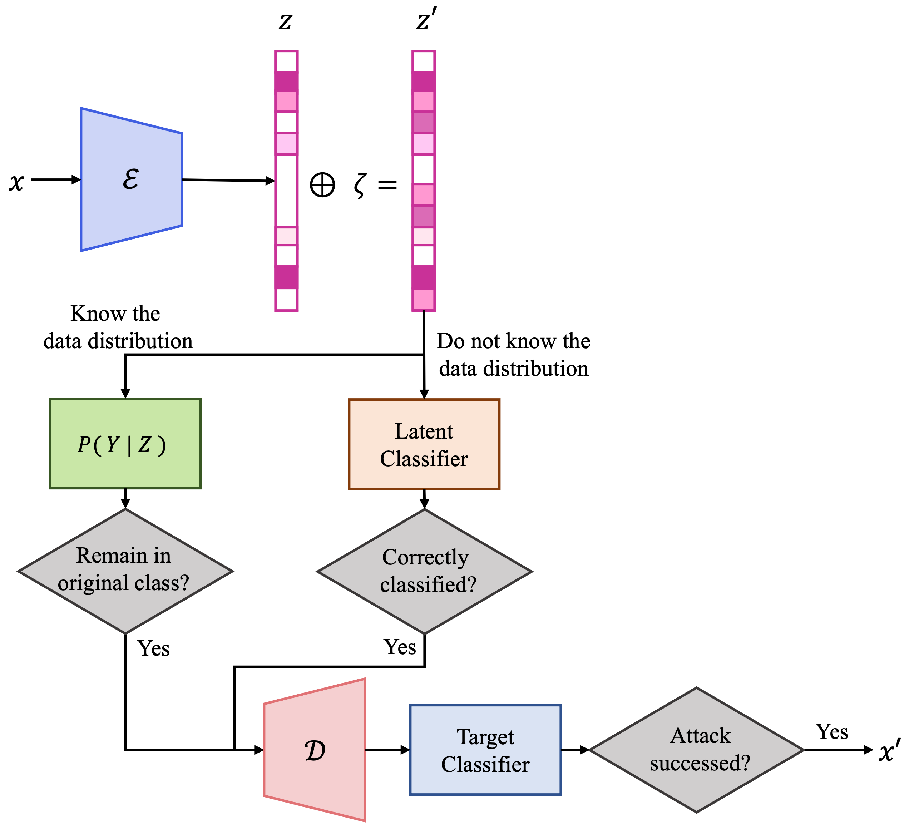

# MC-ATON

This repository provides implementations for ***Improving the Robustness of Model Compression byOn-Manifold Adversarial Training***, (MDPI Future Internet, under review).

 

## Requirements
- Python 3.7
- Pytorch 1.9.2
- numpy 1.19.5
- Pandas 1.0.1
- Scipy 1.4.1
- Scikit-learn 0.22.2
- Jupyter 1.0.0

## Implementations
- Dataloader with preprocessing codes
- Model codes
- train, test codes

##Usage
1. Download dataset ([HAR](https://archive.ics.uci.edu/ml/datasets/human+activity+recognition+using+smartphones))
2. Prepare dataset
3. Run codes in Jupyter notebook